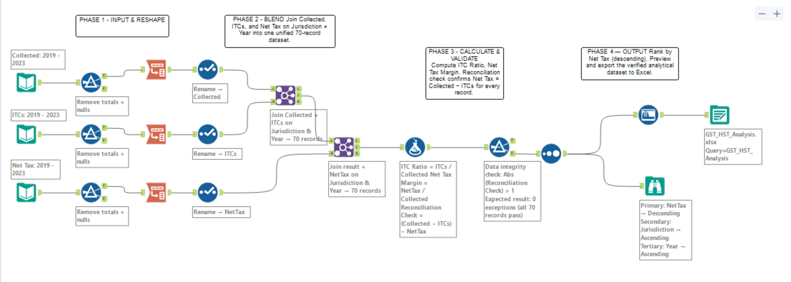

# 🍁 Canadian GST/HST Net Tax Analysis (2019–2023)
 
> An Alteryx data-prep and validation workflow built on real CRA GST/HST statistics — blending five years of tax data across all Canadian provinces and territories into one clean, verified analytical dataset.
 
   
 
---
 
## ❓ The Question
 
> *How much GST/HST do Canadian businesses collect, how much do they reclaim as input credits, what do they remit as net tax — and does the data reconcile?*
 
---
 
## 💡 Key Findings
 
| Metric | 2023 Value |
|---|---|
| 💰 GST/HST Collected | ~$387.6B |
| 🔄 Input Tax Credits Reclaimed | ~$313.5B |
| 🏦 Net Tax Remitted | ~$74.1B |
| ✅ Reconciliation Exceptions | **0 across all 70 records** |
 
- 📉 The **2020 COVID dip** is clearly visible in collections data
- 🏔️ **Northwest Territories** posted negative net tax in 2020
- 📊 Input-tax-credit ratios vary by province based on economic structure
---
 
## 🗂️ Data Sources
 
**CRA GST/HST Statistics — 2025 Edition (2019–2023)**
Open Government Licence – Canada
 
| Table | Contents |
|---|---|
| Table 2 | GST/HST collected by jurisdiction |
| Table 3 | Input tax credits by jurisdiction |
| Table 4 | Net tax by jurisdiction |
 
🔗 [View Dataset on Open Canada](https://open.canada.ca/data/en/dataset/16291938-ae5d-40db-90e3-8b6c09a86ad9)
 
---
 
## 🔧 Workflow Canvas
 

 
---
 
## ⚙️ What the Workflow Does
 
```
 [Ingest] ──▶ [Reshape] ──▶ [Blend] ──▶ [Calculate] ──▶ [Validate] ──▶ [Output]
```
 
| Step | Action |
|---|---|
| 1️⃣ **Ingest** | Loads three CRA source tables (Tables 2, 3, 4) |
| 2️⃣ **Reshape** | Unpivots year columns (2019–2023) into tidy `Jurisdiction │ Year │ Value` format |
| 3️⃣ **Blend** | Joins the three metrics on `Jurisdiction + Year` into one dataset (70 records) |
| 4️⃣ **Calculate** | Derives ITC Ratio and Net Tax Margin per province, per year |
| 5️⃣ **Validate** | Reconciliation check confirms `Net Tax = Collected − ITCs` — zero exceptions |
| 6️⃣ **Output** | Exports the verified analytical dataset to Excel |
 
---
 
## 🛠️ Alteryx Tools Used
 
`Input Data` · `Filter` · `Transpose` · `Select` · `Join` · `Formula` · `Sort` · `Auto Field` · `Browse` · `Output Data`
 
---
 
## 📁 Files
 
| File | Description |
|---|---|
| `GST_HST_Analysis.yxmd` | The Alteryx workflow |
| `GST_HST_Analysis.xlsx` | The verified output dataset |
| `Canvas.png` | Annotated workflow canvas |
 
---
 
## 📝 Notes
 
Built entirely on aggregate public data from the Canada Revenue Agency to demonstrate a repeatable, auditable **tax-analytics data-prep and validation pipeline**. All 70 records (14 jurisdictions × 5 years) pass the reconciliation check with zero exceptions.
 
---
 
*Data sourced under the [Open Government Licence – Canada](https://open.canada.ca/en/open-government-licence-canada)*
